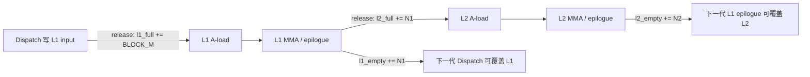

# SM100 FP8×FP4 Mega MoE Scheduler、TaskInfo 与 Full/Empty Counter

> 本文基于当前工作区中的以下实现整理：
>
> - `deep_gemm/include/deep_gemm/impls/sm100_fp8_fp4_mega_moe.cuh`
> - `deep_gemm/include/deep_gemm/scheduler/mega_moe.cuh`
> - `deep_gemm/include/deep_gemm/layout/mega_moe.cuh`
>
> 整理时间：2026-07-30。
>
> 用户问题里两次写了 `l1_full_counter、l1_empty_counter`。本文按代码中的四组
> counter 展开：`l1_full_count`、`l1_empty_count`、`l2_full_count`、
> `l2_empty_count`。

## 1. 先给结论

Mega MoE 里同时存在两套不同层次的生产者—消费者协议：

1. **TaskInfo 调度消息流水线**
   - 对象位于 cluster shared memory。
   - `task_info_full_barriers` 表示某个 TaskInfo 槽已经写好，消费者可以读取。
   - `task_info_empty_barriers` 表示旧 TaskInfo 已经被最后一批消费者释放，scheduler
     可以复用这个槽。
   - 这是一个两级 ping-pong 流水线，只负责传递“下一块算什么”。

2. **L1/L2 数据 ring-buffer 生命周期**
   - counter 位于全局 symmetric workspace。
   - `l1_full_count`：dispatch 已经把 L1 输入 token 填好。
   - `l1_empty_count`：所有 L1 N tile 已经完成，dispatch 可以复用该 L1 ring slot。
   - `l2_full_count`：L1 epilogue 已经把 L2 输入激活及 scale 写好。
   - `l2_empty_count`：所有 L2 N tile 已经读完该 L2 输入，下一代 L1 epilogue
     可以覆盖该 L2 ring slot。
   - 这是数据可见性和物理 buffer 复用协议。

两套机制不能混为一谈：

- TaskInfo full 不代表输入数据 full。
- scheduler 领取了 L2 task，不代表 L2 激活已经 ready。
- `l1_task_count`/`l2_task_count` 是任务领票计数，不是数据 full/empty counter。

完整路径可以概括为：

```text
dispatch
  ├─ 等 l1_empty
  ├─ 写 L1 input ring
  └─ l1_full += token/padding
           │
           ▼
L1 GEMM
  ├─ A-load 等 l1_full
  ├─ MMA
  ├─ epilogue 等上一代 l2_empty
  ├─ 写 L2 input ring
  ├─ l2_full += 1 / L1 N block
  └─ l1_empty += 1 / L1 N block
           │
           ▼
L2 GEMM
  ├─ A-load 等 l2_full
  ├─ MMA
  ├─ epilogue: l2_empty += 1 / L2 N block
  └─ 写 remote combine buffer
```

## 2. 一个 Mega task 到底是什么

### 2.1 一个 task 对应一个 2-CTA cluster tile

当前实现固定使用 2-CTA cluster。一个 scheduler task 描述：

- 一个 M block；
- 一个 `n_cluster_idx`；
- 两个相邻的 N block。

两个 CTA 共享同一个 `TaskInfo`，但各自处理不同的 N block：

```cpp
const uint32_t n_block_idx =
    task_info.n_cluster_idx * 2 +
    (is_leader_cta ? 0u : 1u);
```

即：

```text
TaskInfo.n_cluster_idx = q

leader CTA   -> N block 2q
follower CTA -> N block 2q + 1
```

因此 scheduler 中的：

```cpp
kNumL1Clusters = kNumL1BlockNs / 2;
kNumL2Clusters = kNumL2BlockNs / 2;
```

统计的是 2-CTA task 数，不是单 CTA 的 N block 数。

### 2.2 四种计算 phase

`BlockPhase` 定义在 `scheduler/mega_moe.cuh`：

| Phase | 含义 | A 输入 | B 权重 | 输出 |
|---|---|---|---|---|
| `Linear1` | routed expert 第一层 | dispatch 后的 L1 ring | routed L1 weights | post-SwiGLU FP8，写 L2 ring |
| `Linear2` | routed expert 第二层 | L2 ring | routed L2 weights | BF16，写 remote combine slot |
| `SharedLinear1` | shared expert 第一层 | shared L1 input | shared L1 weights | post-SwiGLU FP8，写 shared L2 buffer |
| `SharedLinear2` | shared expert 第二层 | shared L2 buffer | shared L2 weights | BF16，写本 rank shared combine slot |
| `None` | 结束哨兵 | 无 | 无 | 让所有 consumer 退出 |

`TaskInfo::is_shared()` 通过 `block_phase > Linear2` 判断 shared path。

## 3. TaskInfo 里装了什么

当前 `TaskInfo` 是一个 32B、16B 对齐的结构：

```cpp
template <bool kHasSharedExperts>
struct alignas(16) TaskInfo {
    BlockPhase block_phase;
    uint32_t local_expert_idx;
    uint32_t m_block_idx;
    uint32_t n_cluster_idx;
    uint32_t pool_block_idx;
    uint32_t valid_m;
    uint32_t shape_n;
    uint32_t shape_k;
};
```

各字段含义如下。

### 3.1 `block_phase`

决定当前执行 L1/L2、routed/shared，并据此选择：

- activation TMA descriptor；
- weight TMA descriptor；
- scale-factor descriptor；
- epilogue 分支。

### 3.2 `local_expert_idx`

routed task 对应的本地 expert 编号，用于计算 routed weight 的 expert 偏移。

shared task 不需要 routed expert 偏移，当前填 0。

### 3.3 `m_block_idx`

routed task 中表示当前 block 在该 expert 内部的 M-block 编号。

当前 FP8×FP4 kernel 的实际地址计算主要使用 `pool_block_idx`，`m_block_idx`
只出现在一段历史优化注释中，没有直接参与当前数据地址计算。

### 3.4 `n_cluster_idx`

表示当前 2-CTA task 负责哪一对相邻 N block：

```text
n_cluster_idx = 0 -> CTA0/CTA1 处理 N block 0/1
n_cluster_idx = 1 -> CTA0/CTA1 处理 N block 2/3
...
```

### 3.5 `pool_block_idx`

这是最关键的 M-block 标识。

对于 routed experts，所有本地 expert 的 M block 按 expert 顺序拼成一个逻辑 pool：

```text
expert 0 的所有 M blocks
expert 1 的所有 M blocks
...
expert E_local - 1 的所有 M blocks
```

`pool_block_idx` 是该拼接空间中的全局逻辑 block 编号。

实际物理 ring slot 为：

```cpp
ring_block_idx = pool_block_idx % kNumRingBlocks;
```

ring generation 为：

```cpp
generation = pool_block_idx / kNumRingBlocks;
```

shared task 不使用 routed ring，`pool_block_idx` 直接等于 shared token 的
M-block 编号。

### 3.6 `valid_m`

当前 M block 的真实 token 数：

```cpp
valid_m = min(num_tokens_of_expert - block_begin, BLOCK_M);
```

最后一个 block 可能不足 `BLOCK_M`。`valid_m` 用于：

- 动态设置 UMMA 的有效 M；
- epilogue 跳过 padding row；
- follower CTA 计算自己的 M 起点。

### 3.7 `shape_n` / `shape_k`

描述当前 phase 的逻辑 GEMM 形状，主要用于：

- 决定 K pipeline 循环次数；
- 选择 routed/shared weight 偏移；
- 支持 L1/L2 使用不同 K。

理论上它们可以由 `block_phase` 和模板常量推导；当前为了让 consumer
直接使用，将其放进了 TaskInfo。

## 4. Scheduler 在 kernel 里怎样串起来

### 4.1 每个 warp 的角色

FP8×FP4 kernel 中主要 warp 角色如下：

| warp 范围 | 角色 |
|---|---|
| `[0, kNumDispatchWarps)` | dispatch/count/pull/cleanup |
| `kNumDispatchWarps` | activation 和 SFA 的 TMA load |
| `kNumDispatchWarps + 1` | weight 和 SFB 的 TMA load |
| `kNumDispatchWarps + 2` | MMA issue，仅 leader CTA 执行 |
| `kNumDispatchWarps + 3` | task scheduler，仅 leader CTA 执行 |
| 后续 warps | epilogue，两个 CTA 都执行 |

当前 heuristic 使用 `kNumDispatchThreads = 128`，所以
`kNumDispatchWarps = 4`。对应的具体映射是：

```text
warp 0–3 : dispatch
warp 4   : activation/SFA TMA load
warp 5   : weight/SFB TMA load
warp 6   : MMA issue，仅 leader CTA
warp 7   : TaskInfo producer，仅 leader CTA
warp 8+  : epilogue
```

因此“warp 7 专门发布 task”对当前配置成立；通用实现判断的是
`warp_idx == kNumDispatchWarps + 3`，并没有把 7 写死。

所有角色各自构造同一个 `MegaMoEScheduler` 视图，但行为不同：

- leader CTA 的 scheduler warp 调用 `scheduler.mainloop()`，是 TaskInfo producer；
- A-load、B-load、MMA 和 epilogue 调用 `scheduler.get_next_task()`，是消费者；
- 只有 epilogue 调用 `release_task_info()`，负责最终释放消息槽。

### 4.2 Scheduler 先获得 expert block 分布

dispatch 汇总出每个 local expert 收到的 token 数，写到
`expert_recv_count_sum`。

scheduler 的 `fetch_expert_recv_count()` 等待所有 SM、所有 rank 的计数到齐，
并把每个 expert 的 token 数缓存到 warp registers：

```cpp
while (high_32_bits(value) != kNumSMs * kNumRanks);
stored_num_tokens_per_expert[i] = low_32_bits(value);
```

随后计算：

```text
每个 expert 的 num_m_blocks = ceil(num_tokens / BLOCK_M)
num_total_m_blocks = 所有 local expert 的 num_m_blocks 之和
```

`create_task()` 再根据 `pool_block_idx` 所在的 expert prefix 区间，填出：

- `local_expert_idx`
- expert 内 `m_block_idx`
- `valid_m`

### 4.3 全局 task counter 负责动态领票

workspace 中有四个 scheduler task counter：

```text
l1_task_count
l2_task_count
shared_l1_task_count
shared_l2_task_count
```

每个 CTA-pair 的 scheduler warp 通过：

```cpp
atomic_add(task_count_ptr, 1)
```

领取唯一 task index。这样不同 CTA-pair 动态抢任务，可以缓解 expert
token 分布不均造成的 tail。

再次强调：

> task counter 只表示某个 task index 已被 scheduler 领取，不表示对应数据已经产生。

### 4.4 routed L1/L2 的调度顺序

调度器先发若干波 L1 warmup task，避免所有 scheduler 都先拿到 L2 task
并等待尚未发布的 L1，从而形成死锁。

warmup 之后，每个 scheduler 大体按：

```text
L2 -> L1 -> L2 -> L1 -> ...
```

交错领取。

在创建 L2 TaskInfo 后，scheduler 还会等待：

```cpp
l1_task_count >= (pool_block_idx + 1) * kNumL1Clusters
```

含义是：

> 发布 M block `p` 的 L2 task 之前，至少要保证 `[0, p]` 的全部 L1 N-cluster
> task 已经被某些 scheduler 领取。

这仍然只是“任务已经发出去”，不是“L1 输出已经完成”。真正的数据 ready
由 `l2_full_count` 控制。

### 4.5 shared task 的顺序

有 shared expert 时，scheduler mainloop 当前采用：

```text
全部 SharedLinear1 task 已领取/发布
    ↓
等待 routed dispatch count
    ↓
全部 routed Linear1/Linear2 task 已领取/发布
    ↓
全部 SharedLinear2 task 已领取/发布
    ↓
None sentinel
```

SharedLinear1 可以与 routed dispatch 重叠，因为 shared 输入不依赖跨 rank
dispatch。这里的“全部”指全局 task counter 已经发完这些 task，不表示它们
已经执行完成；真正执行时仍由各自的 full counter 等待数据 ready。

### 4.6 按代码段展开 scheduler 主逻辑

#### 4.6.1 基本记号

为了说明 warmup 和交错顺序，定义：

```text
C  = kNumSMs / 2       // 全 grid 的 CTA-pair/scheduler 数
M  = num_total_m_blocks
B1 = kNumL1Clusters    // 每个 routed M block 的 L1 cluster task 数
B2 = kNumL2Clusters    // 每个 routed M block 的 L2 cluster task 数
```

其中：

```text
B1 = L1_SHAPE_N / BLOCK_N / 2
B2 = L2_SHAPE_N / BLOCK_N / 2
```

除以 2 是因为一个 task 对应一个 2-CTA cluster，两个 CTA 分别计算相邻的
两个 N block。

一个“全局 wave”大约是 `C` 个 task：每个 CTA-pair scheduler 各领取一个。
代码中的 `num_sched_l1_waves` 是每个 scheduler 的本地配额；所有 scheduler
各发一个 L1 task，合起来才形成一个全局 L1 wave。

#### 4.6.2 SharedLinear1 领票

有 shared expert 时首先进入统一的 `shared_mainloop()`：

```cpp
constexpr uint32_t kNumNClusters = kShapeN / BLOCK_N / 2;
const uint32_t num_m_blocks = ceil_div(num_tokens, BLOCK_M);
const uint32_t num_tasks = num_m_blocks * kNumNClusters;

while (true) {
    task_info_empty_barriers[stage].wait(previous_phase);

    task_idx = atomic_add(shared_task_count, 1);
    if (task_idx >= num_tasks)
        break;

    m_block_idx   = task_idx / kNumNClusters;
    n_cluster_idx = task_idx % kNumNClusters;
    publish_task(...);
}
```

Shared task 中：

```text
pool_block_idx   = m_block_idx
local_expert_idx = 0
```

多个 shared expert 已经沿矩阵 N/K 维拼成一个大 GEMM，因此 scheduler 不再
为每个 shared expert 单独设置 `local_expert_idx`。

SharedLinear1 直接读取本 rank 的原始输入，不依赖 routed dispatch，所以它
可以与 dispatch warps 的跨 rank count、metadata 交换和 token pull 重叠，
用于隐藏通信延迟。

某个 scheduler 看到 `shared_l1_task_count` 越界，只能说明所有合法
SharedLinear1 task index 已经在全 grid 被领取；最后一些 task 可能还没有
发布完或执行完。这里没有额外的全 grid barrier。

#### 4.6.3 等待 routed expert token count

SharedLinear1 领票阶段之后，scheduler 调用：

```cpp
fetch_expert_recv_count();
```

它等待每个 local expert 的跨 rank token count 汇总完成，缓存每个 expert
的 token 数，并计算：

```text
每个 expert 的 num_m_blocks = ceil(num_tokens / BLOCK_M)
M = 所有 local expert 的 num_m_blocks 之和
```

有了这些信息，`create_task()` 才能把全局 routed `pool_block_idx` 映射成：

```text
local_expert_idx
expert 内 m_block_idx
valid_m
```

#### 4.6.4 warmup 下界一：覆盖首个 L2 wave

首个全局 L2 wave 可以领取 `C` 个 L2 task。每个 M block 有 `B2` 个 L2
cluster task，所以首个 L2 wave 最多触及：

```text
first_l2_m_blocks = ceil(C / B2)
```

这些 M block 一共依赖：

```text
first_l2_m_blocks × B1
```

个 L1 cluster task。换算成 L1 wave：

```text
W_first = ceil(ceil(C / B2) × B1 / C)
```

对应代码：

```cpp
num_first_l2_wave_m_blocks =
    ceil_div(num_clusters, num_l2_n_clusters);

num_l1_warmup_clusters_for_first_l2_wave =
    ceil_div(
        num_first_l2_wave_m_blocks * num_l1_n_clusters,
        num_clusters);
```

它保证的不是“一个 L2 task 的 L1 已经发出”，而是：

> 首批可能同时占满所有 CTA-pair 的 L2 task 所触及的 M block，其全部 L1
> cluster task 都已经进入领取/发布链路。

否则所有 CTA-pair 都可能拿到 L2 并等待 L1 数据，却没有 CTA-pair 继续推进
相应的 L1。

#### 4.6.5 warmup 下界二：补偿交错积压差

warmup 结束后，每个 scheduler 近似一比一交错 L2 和 L1。如果：

```text
B1 > B2
```

那么 L2 每跨过一个 M block 只需要 `B2` 个 task，而 L1 需要 `B1` 个 task。
一比一交错会对每个已经跨过的 M block 积压：

```text
B1 - B2
```

个 L1 task。最后一个 M block 是最紧约束，warmup 需要提前覆盖：

```text
B1 + (M - 1) × max(B1 - B2, 0)
```

个 L1 task。换算成 wave，并为不完整 wave 的异步边界保留一个额外 wave：

```text
W_debt =
    ceil(
        [B1 + (M - 1) × max(B1 - B2, 0)] / C
    ) + 1
```

最终：

```text
W_min = max(W_first, W_debt)
W     = min(W_min, ceil(M × B1 / C))
```

最后一项保证 warmup 不超过全部 L1 task 自身需要的 wave 数。

例如：

```text
H = 7168
I = 2048
BLOCK_N = 128
kNumSMs = 148

C  = 74
B1 = (2 × I) / BLOCK_N / 2 = 16
B2 = H / BLOCK_N / 2       = 28
```

则：

```text
W_first = ceil(ceil(74 / 28) × 16 / 74) = 1
W_debt  = ceil(16 / 74) + 1             = 2
W_min   = 2
```

这里 `B1 < B2`，不存在逐 M block 的 L1 积压差；最终两波 warmup 来自第二个
下界中保守的 `+1 wave`。

#### 4.6.6 routed L1/L2 状态机

`get_next_task()` 可以简化成：

```cpp
if (还有 warmup L1 配额) {
    --num_sched_l1_waves;
    return claim_L1();
} else {
    task = claim_L2();
    if (L2 已经领完)
        return None;

    if (L1 尚未耗尽)
        把下一次本地配额设置成 1 个 L1;

    等待该 L2 所需的 L1 ticket 已领取;
    return task;
}
```

因此单个 scheduler 的局部序列是：

```text
L1 × W
L2
L1
L2
L1
...
```

不同 scheduler 独立推进，所以全局只表现为大致交错，并不是严格的：

```text
完整一波 L2 → 完整一波 L1
```

当某个 scheduler 领取到越界的 L1 index 时：

```cpp
num_sched_l1_waves = kNumSchedL1WavesDone;
```

以后不再为下一次设置 L1 配额，只持续领取 L2：

```text
... → L2 → L1 → L2 → L1
L1 ticket 耗尽
... → L2 → L2 → L2
```

当前常见配置中 `B1 < B2`，因此自然形成 L2-only tail。如果 `B1 > B2`，
前面的 warmup 会预先发出额外 L1，目的是避免 L2 结束时仍残留合法 L1 task。

#### 4.6.7 L2 发布前检查的是 L1 ticket，不是 L1 数据

领取 L2 task 后，scheduler 计算它对应的 `pool_block_idx`，然后等待：

```cpp
const auto num_required_l1_tasks =
    (task_info.pool_block_idx + 1) * kNumL1Clusters;

while (l1_task_count < num_required_l1_tasks) {}
```

它保证 `[0, pool_block_idx]` 的所有合法 L1 cluster task 已经被某些
scheduler 原子领取，已经进入发布链路。

它不保证：

```text
L1 TaskInfo 已被所有 consumer 读取
L1 GEMM 已经执行
L1 epilogue 已经写完 l2_token_buffer
```

producer 在领取 task 前已经等待当前 TaskInfo slot empty，因此领取到 L1
ticket 后通常会立即构造并发布；但另一个 scheduler 仍可能在对应 TaskInfo
真正发布前观察到已经增长的 global `l1_task_count`。

这个等待属于任务级依赖，用于保持依赖方向和避免调度死锁；真正的 L1 输出
ready 由 `l2_full_count` 判断。

#### 4.6.8 L1 耗尽、SharedLinear2 与 sentinel

当 L1 ticket 耗尽后，scheduler 进入 L2-only tail；当 L2 ticket 也耗尽时，
`get_next_task()` 返回无效 task，routed mainloop 结束。

如果存在 shared expert，随后调用：

```cpp
shared_mainloop<SharedLinear2>(...);
```

这仍然只是领取和发布 SharedLinear2 TaskInfo。实际 A-load 在读取某个 shared
M block 前还要等待：

```text
shared_l2_full_count[pool_block_idx] == target
```

最后 scheduler 等待一个 TaskInfo slot 空闲，并发布：

```text
BlockPhase::None
```

作为当前 CTA-pair 的结束 sentinel。A-load、B-load、MMA 和 epilogue 的
`get_next_task()` 看到 `None` 后退出各自循环。

#### 4.6.9 TaskInfo 发布与数据 ready 是两层协议

scheduler 和 TaskInfo barrier 只回答：

> 这个 CTA-pair 接下来执行哪一种 GEMM、处理哪个 M/N tile？

global full/empty counter 才回答：

> 这个 task 的 activation 是否可读？它的输出 ring slot 是否可以覆盖？

主要等待关系是：

| 位置 | 等待对象 | 作用 |
|---|---|---|
| dispatch 写 routed L1 ring 前 | `l1_empty_count` | 上一代 L1 已读完 |
| RoutedLinear1 A-load | `l1_full_count` | routed token 已全部 pull 到 L1 ring |
| RoutedLinear1 epilogue 写 L2 ring 前 | `l2_empty_count` | 上一代 L2 已读完 |
| RoutedLinear2 A-load | `l2_full_count` | 当前 M block 的 L1 intermediate 已全部写完 |
| SharedLinear2 A-load | `shared_l2_full_count` | 当前 shared M block 的 L1 intermediate 已全部写完 |

实际执行链是：

```text
TaskInfo full
    ↓
consumer 得知“做什么”
    ↓
A-load 检查对应 full counter
    ↓
activation 数据真的 ready
    ↓
TMA / MMA / epilogue
```

TaskInfo 已发布但数据尚未 ready 时，A-load warp 会在 global counter 上等待；
这也是当前实现可能产生 head-of-line blocking 的位置。

## 5. TaskInfo 双缓冲怎样工作

### 5.1 shared-memory 对象

每个 CTA 的 shared storage 中有：

```cpp
task_info_t task_infos[2];
Barrier task_info_full_barriers[2];
Barrier task_info_empty_barriers[2];
```

对应两级 ping-pong：

```text
stage 0 -> stage 1 -> stage 0(下一 phase) -> stage 1(下一 phase) -> ...
```

`sched_stage_idx` 在 0/1 之间切换；每次绕回 stage 0 时翻转
`sched_phase`，用于区分同一物理 barrier 的不同代。

### 5.2 `task_info_full_barriers`

它回答的问题是：

> 这个 stage 的新 TaskInfo 是否已经完整写入本 CTA 的 shared memory？

producer 的 `publish_task()` 中：

```cpp
if (lane_idx < 2) {
    task_info_full_barriers[stage].arrive_and_expect_tx(
        sizeof(TaskInfo), lane_idx);
    st_async_cluster(
        task_infos + stage,
        task_info,
        lane_idx,
        task_info_full_barriers[stage]);
}
```

- scheduler 在 leader CTA 中运行；
- lane 0 把同一个 TaskInfo 写到 CTA 0；
- lane 1 把同一个 TaskInfo 写到 CTA 1；
- 使用 cluster async store；
- transaction barrier 同时跟踪 arrival 和 `sizeof(TaskInfo)` 字节的写入完成。

消费者调用：

```cpp
task_info_full_barriers[stage].wait(phase);
task_info = task_infos[stage];
```

full barrier 完成后，消费者才读取 TaskInfo，所以不会读到部分写入的数据。

它不是“有多少 consumer 已经读取”的引用计数；它只负责 producer →
consumer 的发布可见性。多个 consumer 对同一 phase 的 `wait()` 都只是观察
完成状态，不会消耗 full barrier；TaskInfo 槽的消费引用计数由 empty
barrier 单独承担。

### 5.3 `task_info_empty_barriers`

它回答的问题是：

> 旧 TaskInfo 的最后一批 consumer 是否已经不再依赖 shared-memory 槽，
> producer 能否覆盖这个 stage？

初始化时：

```cpp
kNumScheduleConsumerThreads = 2 * kNumEpilogueThreads;
task_info_empty_barriers[i].init(kNumScheduleConsumerThreads);
```

这里乘 2 是因为一个 cluster 有两个 CTA，两边的 epilogue threads
都要消费同一个 task。

epilogue 的顺序是：

```cpp
get_next_task(task_info);
wait(tmem_full);
release_task_info();
继续使用寄存器中的 task_info 做 epilogue;
```

`release_task_info()` 内部：

```cpp
task_info_empty_barriers[consumed_stage].arrive(0u);
```

`0u` 表示把 arrival 发到 cluster rank 0，即 leader CTA 的对应 empty
barrier。两个 CTA 的 epilogue threads 最终都汇聚到 leader CTA。

producer 在复用 stage 前执行：

```cpp
task_info_empty_barriers[stage].wait(previous_phase);
```

只有所有 epilogue consumer 都 arrive 后，scheduler 才能覆盖旧 TaskInfo。

### 5.4 为什么 A-load/B-load/MMA 不单独 release

A-load、B-load 和 MMA warp 也读取 TaskInfo，但 empty barrier 的 arrival
只由 epilogue threads 提供。

这是因为 epilogue 在 `tmem_full_barrier` 完成后才 release。走到这里意味着：

1. A/B TMA 已按该 TaskInfo 完成当前 GEMM 的输入流水；
2. MMA 已完成该 task 并发布 TMEM accumulator；
3. epilogue 已将 TaskInfo 复制到线程本地变量。

因此 epilogue 被当作整个 task 的“最后逻辑消费者”，它的 release
间接覆盖了前面的 A/B/MMA consumer。

这也解释了一个重要约束：

> 不能只把 `release_task_info()` 随意移动到 epilogue 的 `tmem_full`
> 等待之前；否则 scheduler 可能在 A/B/MMA 尚未读取旧槽时就覆盖 TaskInfo。

## 6. 四组 L1/L2 full/empty counter

### 6.1 为什么 counter 不是 0/1 flag

routed activation buffer 是 ring buffer。不同逻辑 `pool_block_idx`
可能复用同一个物理 `ring_block_idx`：

```cpp
ring_block_idx = pool_block_idx % kNumRingBlocks;
generation     = pool_block_idx / kNumRingBlocks;
```

所以 full/empty 采用**单调累计值**，而不是每轮把 flag 从 0/1 来回翻转。

这样第 `g` 代只需等待目标累计值：

```text
第 0 代目标：1 × 每代贡献
第 1 代目标：2 × 每代贡献
...
第 g 代目标：(g + 1) × 每代贡献
```

kernel 结束时再统一清零，供下一次 kernel 调用复用。

下面定义：

```text
g  = floor(pool_block_idx / kNumRingBlocks)
r  = pool_block_idx % kNumRingBlocks
N1 = L1_SHAPE_N / BLOCK_N       // 一个 M block 的 L1 单-CTA N block 数
N2 = L2_SHAPE_N / BLOCK_N       // 一个 M block 的 L2 单-CTA N block 数
```

对于 SwiGLU：

```text
L1_SHAPE_N = 2 × intermediate_hidden
L2_SHAPE_K = intermediate_hidden

所以：
N1 = 2 × L2_SHAPE_K / BLOCK_N
```

### 6.2 `l1_full_count`

#### producer

dispatch 把远端 token data、SF、top-k weight 和 metadata 写入本 rank 的
L1 ring。

每完成一个 token，执行：

```cpp
red_add_rel(l1_full_count[r], 1);
```

对于 expert 最后一个不足 `BLOCK_M` 的 block，最后一个真实 token 会把
padding 数量一起补上：

```cpp
is_last_token
    ? BLOCK_M - token_idx_in_block
    : 1
```

因此每个逻辑 M block 对 `l1_full_count` 的累计贡献恒为 `BLOCK_M`，
无论真实 `valid_m` 是多少。

#### consumer

Linear1 的 activation TMA warp 等待：

```cpp
l1_full_count[r] == BLOCK_M * (g + 1)
```

等式成立表示这一代 L1 block 的全部真实 token 和 padding 发布已经完成，
可以安全发起 L1 activation TMA load。

#### 内存序

dispatch 使用 release red-add；A-load 使用 acquire load。

因此看到目标 `l1_full_count` 后，也能看到 counter 之前写入的：

- token data；
- activation SF；
- top-k weight；
- source metadata。

### 6.3 `l1_empty_count`

#### producer

每个 Linear1 task 的 epilogue 完成 post-SwiGLU、FP8 量化及 L2 TMA store 后，
两个 CTA 各自增加一次：

```cpp
l1_empty_count[r] += 1;
```

一个 2-CTA task 对应两个单-CTA N block，因此最终每个逻辑 M block
累计增加：

```text
N1 = L1_SHAPE_N / BLOCK_N
```

这里要等到 L1 epilogue，而不是 A-load 刚读完就释放，是因为 L1 epilogue
仍然需要该 ring block 对应的 top-k weight。

#### consumer

dispatch 准备让 generation `g` 使用物理 slot `r` 前等待：

```cpp
l1_empty_count[r] >= g * N1
```

- `g = 0` 时目标为 0，第一次使用不等待；
- `g = 1` 时，必须等第 0 代所有 L1 N block 完成；
- `g = 2` 时，必须等累计完成两代，以此类推。

这阻止 dispatch 提前覆盖仍被上一代 L1 epilogue 使用的：

- L1 activation ring；
- L1 activation SF ring；
- L1 top-k weight ring。

### 6.4 `l2_full_count`

#### producer

Linear1 epilogue 完成：

1. SwiGLU；
2. FP8 E4M3 量化；
3. UE8M0 scale 写入；
4. L2 activation 的 TMA store；

并执行 `tma_store_wait<0>()` 后，每个 CTA 增加一次：

```cpp
l2_full_count[r] += 1;
```

所以每个逻辑 M block 的总贡献也是 L1 的单-CTA N block 数：

```text
N1 = L1_SHAPE_N / BLOCK_N
   = 2 × L2_SHAPE_K / BLOCK_N
```

#### consumer

Linear2 activation TMA warp 等待：

```cpp
l2_full_count[r]
    == (L2_SHAPE_K / BLOCK_N) * 2 * (g + 1)
    == N1 * (g + 1)
```

也就是说，只有该 M block 的所有 L1 N block 都完成 post-SwiGLU
和 L2 input store 后，L2 GEMM 才开始读取这一行激活。

这和 scheduler 中的 `l1_task_count` 等待不同：

```text
l1_task_count ready -> 所需 L1 task 已经被领取
l2_full_count ready -> 所需 L1 task 的数据输出真的全部完成
```

### 6.5 `l2_empty_count`

#### producer

Linear2 的 MMA 已经完成、epilogue 拿到 TMEM accumulator 后，每个 CTA
在 L2 epilogue 开始处增加一次：

```cpp
l2_empty_count[r] += 1;
```

此时 L2 activation 已经被 TMA/MMA 流水消费完；后续 BF16 输出和 remote
combine store 不再读取 L2 input ring。

每个逻辑 M block 最终贡献：

```text
N2 = L2_SHAPE_N / BLOCK_N
```

#### consumer

generation `g` 的 Linear1 epilogue 在覆盖物理 L2 slot `r` 前等待：

```cpp
l2_empty_count[r] == g * N2
```

- 第 0 代不等待；
- 第 1 代必须等第 0 代所有 L2 N block 已经消费输入；
- 然后当前 L1 epilogue 才能写入新一代 L2 activation 和 SF。

### 6.6 四组 counter 的闭环

对同一个物理 ring slot，可以画成：



更准确地说：

| Counter | 谁增加 | 每个逻辑 M block 的总增量 | 谁等待 |
|---|---|---:|---|
| `l1_full_count[r]` | dispatch | `BLOCK_M` | Linear1 A-load |
| `l1_empty_count[r]` | Linear1 epilogue | `N1` | 下一代 dispatch |
| `l2_full_count[r]` | Linear1 epilogue | `N1` | Linear2 A-load |
| `l2_empty_count[r]` | Linear2 epilogue | `N2` | 下一代 Linear1 epilogue |

## 7. 一条 routed M block 的完整时间线

假设 scheduler 生成：

```text
TaskInfo {
    block_phase     = Linear1 / Linear2
    local_expert_idx = e
    pool_block_idx   = p
    n_cluster_idx    = q
    valid_m          = v
}
```

完整过程如下。

### 7.1 Dispatch 阶段

1. 根据 expert token count 算出 `pool_block_idx = p`。
2. 算出物理 slot `r = p % kNumRingBlocks` 和 generation `g`。
3. 等待 `l1_empty_count[r] >= g * N1`。
4. 从 source rank pull token。
5. 写 L1 token、SF、top-k weight、metadata。
6. release-add `l1_full_count[r]`。
7. partial block 的最后一个 token 补足到 `BLOCK_M`。

### 7.2 Scheduler 发布 Linear1

1. 从 `l1_task_count` 原子领取 task index。
2. 将全局 M-block index 映射到 local expert 和 expert 内 M block。
3. 填充 Linear1 TaskInfo。
4. 等待当前 TaskInfo stage empty。
5. 用 cluster async store 向两个 CTA 发布。
6. 两个 CTA 的 full barrier 在 TaskInfo 写完后 ready。

### 7.3 Linear1 执行

1. A-load warp 读取 TaskInfo。
2. 等待 `l1_full_count[r] == BLOCK_M * (g + 1)`。
3. A-load/B-load 将 activation、weight 和 SF 放入 GEMM pipeline。
4. leader CTA 发出 2-CTA UMMA。
5. MMA 完成后通知 TMEM full。
6. epilogue 读取 accumulator，并释放 TaskInfo stage。
7. 在覆盖 L2 ring 前等待 `l2_empty_count[r] == g * N2`。
8. 执行 SwiGLU、top-k weight、FP8 量化。
9. 写 L2 activation 和 SF。
10. 等 TMA store 完成。
11. 每个 CTA 分别执行：
    - `l2_full_count[r] += 1`
    - `l1_empty_count[r] += 1`

### 7.4 Scheduler 发布 Linear2

1. 从 `l2_task_count` 原子领取 task index。
2. 保证对应范围内的 L1 task 已经被 scheduler 领取。
3. 发布 Linear2 TaskInfo。

注意，这时 L1 可能仍在计算；这里只保证任务已发出。

### 7.5 Linear2 执行

1. A-load warp 读取 Linear2 TaskInfo。
2. 等待 `l2_full_count[r] == N1 * (g + 1)`。
3. 全部 L1 N block 完成后，读取 L2 activation 和 SF。
4. 执行 L2 GEMM。
5. epilogue 拿到 accumulator 后，每个 CTA：
   - `l2_empty_count[r] += 1`
6. L2 epilogue 将 BF16 结果写到 source rank 的 combine slot。

### 7.6 Combine

所有 TaskInfo 消费完并收到 `None` sentinel 后：

1. epilogue warps 做跨 rank barrier；
2. 从 `top-k + optional shared` combine slots 读取结果；
3. FP32 累加；
4. 写最终 BF16 output。

## 8. Shared expert 路径的区别

shared path 不需要 routed dispatch，也不需要 ring generation 复用：

- SharedLinear1 不等待 `l1_full_count`；
- SharedLinear1 epilogue 不更新 routed `l1_empty_count`；
- SharedLinear1 epilogue更新 `shared_l2_full_count[pool_block_idx]`；
- SharedLinear2 等待：

```cpp
shared_l2_full_count[block_idx]
    == (SHARED_L2_SHAPE_K / BLOCK_N) * 2;
```

- shared buffer 每次 kernel 只走一代，因此没有 shared `l2_empty_count`。

`shared_l2_full_count` 的总目标仍然等于该 shared M block 的所有
SharedLinear1 单-CTA N block 数。

## 9. TaskInfo barrier 与数据 counter 的对应关系

这张表是理解整个实现的关键：

| 机制 | 存放位置 | 粒度 | 解决的问题 |
|---|---|---|---|
| `l1/l2/shared_*_task_count` | global workspace | 全 grid | 哪个 CTA-pair 领取哪个 task |
| `task_infos[2]` | cluster shared memory | 单 CTA-pair | 把 task 描述广播给 kernel 内各角色 |
| `task_info_full_barriers[2]` | cluster shared memory | 单 CTA-pair | TaskInfo 是否已完整发布 |
| `task_info_empty_barriers[2]` | cluster shared memory | 单 CTA-pair | TaskInfo 槽是否可以复用 |
| `l1_full_count` | global workspace | routed ring block | dispatch 是否写完 L1 input |
| `l1_empty_count` | global workspace | routed ring block | L1 是否已不再使用该 input slot |
| `l2_full_count` | global workspace | routed ring block | L1 是否写完完整 L2 input |
| `l2_empty_count` | global workspace | routed ring block | L2 是否已不再使用该 input slot |
| `shared_l2_full_count` | global workspace | shared M block | shared L1 是否写完 shared L2 input |

## 10. 必须保持的正确性不变量

后续修改 scheduler 时，至少要保持以下不变量。

### 10.1 所有 TaskInfo consumer 的 stage/phase 必须一致

A-load、B-load、leader CTA 的 MMA，以及两个 CTA 的所有 epilogue
必须按完全相同的 TaskInfo 序列调用 `get_next_task()`。

任何角色漏掉一个 task，都会导致 stage/phase 错位，最终等待错误 barrier。

### 10.2 TaskInfo 槽不能在最后 consumer 读完前覆盖

当前用 epilogue 的 late release 间接保证 A/B/MMA 已消费旧 task。

如果提前 release：

- 必须把 A-load/B-load/MMA 也纳入引用计数；
- 或者证明这些角色已经把 TaskInfo 完整复制到本地。

### 10.3 发布 L2 task 与 L2 数据 ready 是两件事

scheduler 的 `l1_task_count` 检查只防止 task 级死锁。

真正读取 L2 input 前仍必须保持 `l2_full_count` acquire wait，除非新
scheduler 能提供等价的数据完成及内存可见性保证。

### 10.4 ring 容量必须覆盖最大 live frontier

如果修改 L1/L2 交错比例、warmup 波数或 ready-task 选择策略，需要同步重新证明：

```cpp
get_num_max_live_pool_blocks()
```

否则可能出现：

- dispatch 等不到 `l1_empty`；
- L1 epilogue 等不到 `l2_empty`；
- 新 generation 提前覆盖旧数据；
- 极端情况下全 grid 死锁。

### 10.5 full 发布必须带 release，消费必须带 acquire

看到 full counter 目标值必须同时意味着前面的数据写入可见。

因此不能把：

```text
写数据 -> release full counter
acquire full counter -> 读数据
```

简化成没有等价内存序保证的普通 load/store。

## 11. 当前实现中值得继续讨论的点

以下不是本文已经实施的修改，而是基于当前控制链可继续讨论的方向。

### 11.1 L2 task 的 head-of-line blocking

scheduler 发布 Linear2 时只保证 L1 task 已领取；A-load warp 随后可能长时间
等待 `l2_full_count`。

一旦 A-load warp 卡住，这个 CTA-pair 后续已 ready 的 task 也无法越过它。

可以讨论：

- scheduler 保留 pending L2 ticket；
- 未 ready 时继续发 L1；
- 或建立 ready L2 block queue/bitmap。

### 11.2 `task_info_empty_barrier` 的 arrival 粒度

当前每个 epilogue thread 都 arrive，目标 count 是：

```text
2 × kNumEpilogueThreads
```

可以讨论是否安全改成每 warp 一次 arrival：

```text
2 × kNumEpilogueWarps
```

前提是每个 warp 内所有线程已经完成 TaskInfo 复制。

### 11.3 TaskInfo 可以压缩

当前 32B 中：

- `m_block_idx` 没有实际数据地址消费者；
- `shape_n`/`shape_k` 可以由 phase 推导。

可以尝试压成 16B，减少 cluster async store 和 shared-memory load。

### 11.4 shared L2 可以更早交错

当前 SharedLinear2 在 routed task 全部领取/发布之后。

可以讨论当某个 shared M block 的 `shared_l2_full_count` ready 时，是否立即
插入 SharedLinear2，以提前 combine、减少尾部。

### 11.5 full/empty 等待集中到 scheduler

当前多个 A-load/epilogue warp 会在 global counter 上自旋。

可以讨论由 scheduler 检查 ready 状态，只发布可运行 TaskInfo，从而减少：

- 全局 counter 轮询；
- 未 ready task 占住 CTA；
- pipeline head-of-line blocking。

## 12. 源码定位

当前工作区的关键位置：

| 内容 | 文件与行号 |
|---|---|
| L1 warmup wave 公式 | `scheduler/mega_moe.cuh:15-45` |
| `TaskInfo` / `BlockPhase` | `scheduler/mega_moe.cuh:83-136` |
| Scheduler 双缓冲状态 | `scheduler/mega_moe.cuh:177-221` |
| expert block 映射 | `scheduler/mega_moe.cuh:249-306` |
| routed L1/L2 领票和交错 | `scheduler/mega_moe.cuh:309-350` |
| TaskInfo cluster 发布 | `scheduler/mega_moe.cuh:352-362` |
| shared task 动态领票 | `scheduler/mega_moe.cuh:364-381` |
| shared/routed 总调度顺序 | `scheduler/mega_moe.cuh:383-413` |
| TaskInfo shared storage 和 barrier 初始化 | `sm100_fp8_fp4_mega_moe.cuh:174-291` |
| dispatch 的 `l1_empty` 等待 | `sm100_fp8_fp4_mega_moe.cuh:530-536` |
| dispatch 的 `l1_full` 发布 | `sm100_fp8_fp4_mega_moe.cuh:597-603` |
| L1/L2 activation TMA 的 full 等待 | `sm100_fp8_fp4_mega_moe.cuh:676-711` |
| scheduler warp 入口 | `sm100_fp8_fp4_mega_moe.cuh:929-936` |
| epilogue TaskInfo release | `sm100_fp8_fp4_mega_moe.cuh:972-984` |
| L1 epilogue 的 `l2_empty` 等待 | `sm100_fp8_fp4_mega_moe.cuh:997-1003` |
| L1 epilogue发布 `l2_full/l1_empty` | `sm100_fp8_fp4_mega_moe.cuh:1196-1211` |
| L2 epilogue发布 `l2_empty` | `sm100_fp8_fp4_mega_moe.cuh:1214-1221` |
| Workspace counter 布局 | `layout/mega_moe.cuh:140-232` |
